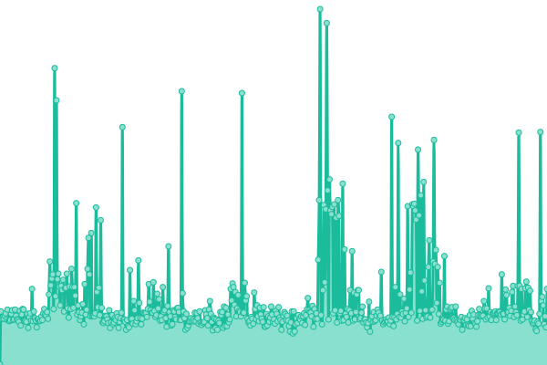
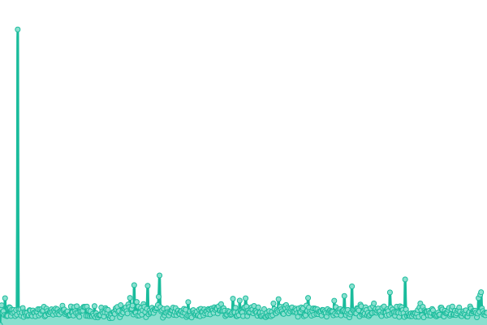

# [📈 Live Status](https://masterkoppa.github.io/UptimeMonitor): <!--live status--> **🟧 Partial outage**

This repository contains the open-source uptime monitor and status page for [Andres Ruiz](andresjruiz.com), powered by [Upptime](https://github.com/upptime/upptime).

With [Upptime](https://upptime.js.org), you can get your own unlimited and free uptime monitor and status page, powered entirely by a GitHub repository. We use [Issues](https://github.com/masterkoppa/UptimeMonitor/issues) as incident reports, [Actions](https://github.com/masterkoppa/UptimeMonitor/actions) as uptime monitors, and [Pages](https://masterkoppa.github.io/UptimeMonitor) for the status page.

<!--start: status pages-->
<!-- This summary is generated by Upptime (https://github.com/upptime/upptime) -->
<!-- Do not edit this manually, your changes will be overwritten -->
<!-- prettier-ignore -->
| URL | Status | History | Response Time | Uptime |
| --- | ------ | ------- | ------------- | ------ |
|  [Google](https://www.google.com) | 🟩 Up | [google.yml](https://github.com/masterkoppa/UptimeMonitor/commits/master/history/google.yml) | 

 61ms
     
 | 

<a href="https://masterkoppa.github.io/UptimeMonitor/history/google">100.00%</a>
    

|  [SmugMug Site](https://masterkoppa.aruiz.io) | 🟥 Down | [smug-mug-site.yml](https://github.com/masterkoppa/UptimeMonitor/commits/master/history/smug-mug-site.yml) | 

 0ms
     
 | 

<a href="https://masterkoppa.github.io/UptimeMonitor/history/smug-mug-site">8.73%</a>
    

|  [Personsal Site](https://aruiz.io) | 🟩 Up | [personsal-site.yml](https://github.com/masterkoppa/UptimeMonitor/commits/master/history/personsal-site.yml) | 

 215ms
     
 | 

<a href="https://masterkoppa.github.io/UptimeMonitor/history/personsal-site">100.00%</a>
    

|  [Personal Site (www)](https://www.aruiz.io/blog) | 🟩 Up | [personal-site-www.yml](https://github.com/masterkoppa/UptimeMonitor/commits/master/history/personal-site-www.yml) | 

 164ms
     
 | 

<a href="https://masterkoppa.github.io/UptimeMonitor/history/personal-site-www">100.00%</a>
    

|  [Personal Site (alt)](https://andresjruiz.com) | 🟩 Up | [personal-site-alt.yml](https://github.com/masterkoppa/UptimeMonitor/commits/master/history/personal-site-alt.yml) | 

 129ms
     
 | 

<a href="https://masterkoppa.github.io/UptimeMonitor/history/personal-site-alt">100.00%</a>
    

|  [Beyond the Tales](https://beyondthetales.com) | 🟩 Up | [beyond-the-tales.yml](https://github.com/masterkoppa/UptimeMonitor/commits/master/history/beyond-the-tales.yml) | 

 173ms
     
 | 

<a href="https://masterkoppa.github.io/UptimeMonitor/history/beyond-the-tales">100.00%</a>
    

|  [NightOwl](https://www.codenamenightowl.com) | 🟥 Down | [night-owl.yml](https://github.com/masterkoppa/UptimeMonitor/commits/master/history/night-owl.yml) | 

 0ms
     
 | 

<a href="https://masterkoppa.github.io/UptimeMonitor/history/night-owl">0.00%</a>
    

<!--end: status pages-->

[**Visit our status website →**](https://masterkoppa.github.io/UptimeMonitor)

## 📄 License

- Powered by: [Upptime](https://github.com/upptime/upptime)
- Code: [MIT](./LICENSE) © [Andres Ruiz](andresjruiz.com)
- Data in the `./history` directory: [Open Database License](https://opendatacommons.org/licenses/odbl/1-0/)
